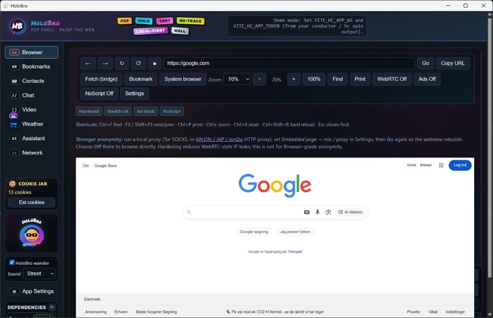
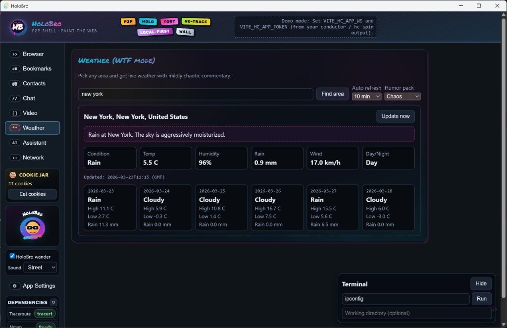
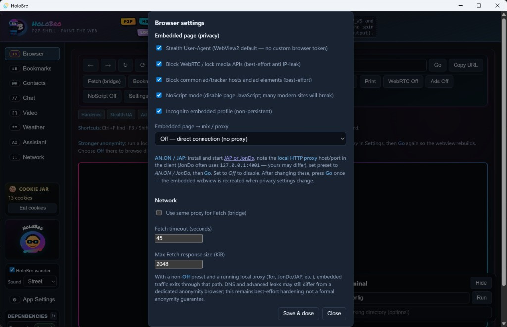
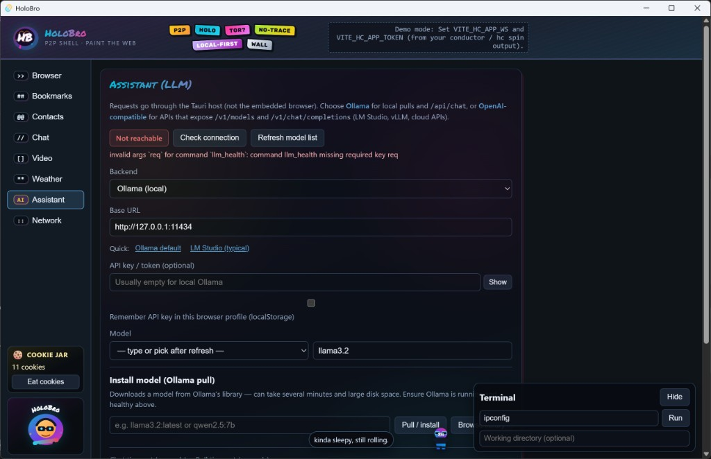

<p align="center">
  
  
</p>
<h1 align="center">HoloBro</h1>
<p align="center"><strong>Street-skater cyberpunk browser shell.</strong></p>

**HoloBro** is a **local-first desktop shell**: **Tauri + React** for the UI, optional **Holochain** for bookmarks, contacts, chat, and WebRTC signaling, plus an embedded **WebView2** / **WebKit** browser, HTTP fetch bridge, LLM assistant hooks, and **network tools** (IP stats, traceroute, rough speed check).

Repository: **[github.com/ta10101/Holobro](https://github.com/ta10101/Holobro)** (GitHub may redirect from `HoloBro`.)

> This project is a **scaffold**. Strong anonymity guarantees, production-grade chat encryption, TURN for WebRTC, and fully hardened web isolation are follow-on work.

---

## Table of contents

- [Screenshots](#screenshots)  
- [Install prebuilt binaries](#install-prebuilt-binaries) (Windows · macOS · Linux)  
- [Uninstall](#uninstall) (including uninstallers)  
- [Build from source](#build-from-source)  
- [Holochain live mode](#holochain-live-mode)  
- [Features](#features)  
- [Releases, dev track, security roadmap](#releases-dev-track-security-roadmap)  
- [Project layout](#project-layout)  
- [License](#license)

---

## Screenshots

<p align="center">
  
  
</p>
<p align="center">
  
  
</p>

---

## Install prebuilt binaries

When [GitHub Releases](https://github.com/ta10101/Holobro/releases) publishes assets, download the file that matches your OS and CPU.

### Windows (x64)

| File | What it is |
|------|------------|
| **`HoloBro_x.x.x_x64-setup.exe`** | **NSIS** installer — recommended for most users. Includes an embedded **WebView2** bootstrapper when the runtime is missing. |
| **`HoloBro_x.x.x_x64_en-US.msi`** (or similar) | **MSI** package — useful for **Intune**, **GPO**, or silent deployment (`msiexec /i HoloBro....msi /qn`). |

**Steps (setup.exe):**

1. Download the latest `HoloBro_*_x64-setup.exe` from Releases.  
2. Double-click it and follow the wizard.  
3. If prompted, allow **WebView2** installation (Microsoft Edge WebView2 Runtime).  
4. Start **HoloBro** from the Start menu or desktop shortcut.

**Steps (MSI):**

1. Download the `.msi` from Releases.  
2. Double-click the MSI, or run `msiexec /i "path\to\HoloBro....msi"` from an elevated prompt if your policy requires it.  
3. Launch **HoloBro** from the Start menu.

**Requirements:** Windows 10/11 x64. WebView2 is installed by the bundle when needed.

---

### macOS

| File | What it is |
|------|------------|
| **`HoloBro_x.x.x_universal.dmg`** or **`HoloBro_x.x.x_aarch64.dmg` / `x64.dmg`** | Disk image with the `.app` bundle (exact name depends on build targets). |

**Steps:**

1. Open the `.dmg`.  
2. Drag **HoloBro.app** into **Applications**.  
3. If Gatekeeper blocks the app: **System Settings → Privacy & Security** → choose **Open Anyway** for HoloBro (or right-click the app → **Open** the first time).

**Requirements:** macOS supported by your Tauri/WebKit stack (see [Tauri macOS prerequisites](https://v2.tauri.app/start/prerequisites/)).

---

### Linux

| File | What it is |
|------|------------|
| **`holobro_x.x.x_amd64.AppImage`** (name may vary) | Single executable-style image; no root needed to try the app. |
| **`.deb`** | For Debian/Ubuntu and derivatives (`apt` / `dpkg`). |

**AppImage:**

1. Download the `.AppImage`.  
2. `chmod +x HoloBro*.AppImage`  
3. Run `./HoloBro*.AppImage`  
4. Optional: use [AppImageLauncher](https://github.com/TheAssassin/AppImageLauncher) for desktop integration.

**.deb (example):**

```bash
sudo apt install ./holobro_*_amd64.deb
# or
sudo dpkg -i holobro_*_amd64.deb && sudo apt-get install -f
```

**Requirements:** See [Tauri Linux dependencies](https://v2.tauri.app/start/prerequisites/) (WebKitGTK, etc.). Wayland/X11 as supported by your distro.

> **Note:** Release assets appear after maintainers run `npm run build:desktop` (or CI) and upload outputs. If Releases is empty, [build from source](#build-from-source) below.

---

## Uninstall

### Windows

| How you installed | How to remove |
|-------------------|----------------|
| **NSIS `.exe` installer** | **Settings → Apps → Installed apps → HoloBro → Uninstall**, *or* **Start menu → HoloBro → Uninstall HoloBro**. The NSIS installer registers a standard **Windows uninstaller** (ARP entry). |
| **MSI** | **Settings → Apps → HoloBro → Uninstall**, *or* `msiexec /x {PRODUCT-GUID}` / **Apps & features**. MSI installs register with **Windows Installer** for clean removal. |

WebView2 is a **shared Microsoft runtime** used by many apps; uninstalling HoloBro does **not** remove WebView2 by design.

### macOS

- Delete **HoloBro** from **Applications** (drag to Trash, or right-click → **Move to Trash**).  
- If you stored preferences in `~/Library`, you may remove related `holobro` / app-id folders manually if you want a full wipe.

### Linux

| Format | Uninstall |
|--------|-----------|
| **AppImage** | Delete the `.AppImage` file (and any `.desktop` file you added). There is no system-wide uninstaller. |
| **`.deb`** | `sudo apt remove holobro` (package name matches the Debian package produced by the bundle; if different, use `dpkg -l | grep -i holo`). |

---

## Build from source

### Supported desktop targets

| Platform | CI compile check | Release artifacts |
|----------|------------------|-------------------|
| **Windows** x64 | yes | NSIS, MSI |
| **Linux** x64 (glibc) | yes | `.deb`, AppImage |
| **macOS** Intel + Apple Silicon | yes (native compile on Apple Silicon runner) | Universal **DMG** (release workflow uses `--target universal-apple-darwin`) |

Pull requests run **lint**, **Vite builds** (all release tiers), and **desktop-check** (`npm run build` + `cargo check -p holobro`) on Ubuntu, Windows, and macOS.

### Prerequisites

- **Node.js** (LTS recommended)  
- **Rust** (`rustup`)  
- **Tauri prerequisites** for your OS: [Windows](https://v2.tauri.app/start/prerequisites/) · [macOS](https://v2.tauri.app/start/prerequisites/) · [Linux](https://v2.tauri.app/start/prerequisites/)

**Rust / `cargo` without a local MSVC toolchain (e.g. Windows + Docker):** you can run a **Linux compile check** of the `holobro` crate inside Docker (same idea as the **`desktop-check`** CI matrix (native three-OS compile)). This catches Rust/Tauri breakage; it does **not** produce a Windows `.exe` (that still needs [Visual Studio Build Tools](https://learn.microsoft.com/en-us/cpp/build/vscpp-step-0-installation) locally, or a **`windows-latest`** runner / release workflow).

```bash
npm run cargo-check:docker
# equivalent: docker build -f docker/rust-check.Dockerfile -t holobro-rust-check .
```

The image creates a minimal `dist/index.html` stub during the build: Tauri’s `generate_context!()` requires `build.frontendDist` to exist even for `cargo check`. Real releases still use `npm run build` before `tauri build`.

**Bundled Holochain (Standard/Full):** run **`npm run fetch:sidecars`** to download pinned `holochain`, `lair-keystore`, and `hc` into `src-tauri/binaries/` (see `holochain-sidecars.manifest.json`). Then `npm run build:desktop:standard` (or `:full`). Prebuilts are **Holochain 0.2.x-class**; align with `@holochain/client` + DNA before retail.

**macOS signing (optional, releases):** repository secrets — `MACOS_CERTIFICATE_BASE64` (p12 base64), `MACOS_CERTIFICATE_PASSWORD`, and for notarization commonly `APPLE_CERTIFICATE`, `APPLE_CERTIFICATE_PASSWORD`, `APPLE_SIGNING_IDENTITY`, `APPLE_ID`, `APPLE_PASSWORD`, `APPLE_TEAM_ID` (see [Tauri signing](https://v2.tauri.app/distribute/sign/macos/)).

**Windows installers (maintainers):**

- **NSIS** — usually **downloaded automatically** by the Tauri CLI on first bundle.  
- **MSI (WiX)** — the Tauri CLI often **downloads WiX** automatically (like NSIS). If the MSI step fails, install [WiX Toolset v3.11+](https://wixtoolset.org/docs/wix3/) (e.g. `winget install WiXToolset.WiXToolset`) so `candle` / `light` are on `PATH`.

### Dev (hot reload)

```bash
npm install
npm run tauri dev
```

### Production bundles (what you upload to Releases)

```bash
npm install
npm run build:desktop
```

**Typical output paths** (under `target/release/bundle/`):

| OS | Artifacts |
|----|-----------|
| **Windows** | `nsis/HoloBro_*_x64-setup.exe`, `msi/HoloBro_*_x64_en-US.msi` |
| **macOS** | `dmg/HoloBro_*.dmg` |
| **Linux** | `appimage/holobro_*.AppImage`, `deb/holobro_*_amd64.deb` |

---

## Run web-only (no desktop shell)

```bash
npm install
npm run dev
```

Open the URL Vite prints (default dev port is aligned with Tauri, often **1420**).

---

## Holochain live mode

**Data policy (what syncs by default):** see [docs/HOLOBRO_DATA_CLASSES.md](./docs/HOLOBRO_DATA_CLASSES.md). **Operator checklist (env, toggles, limits):** [docs/HOLOBRO_PRIVACY_OPERATORS.md](./docs/HOLOBRO_PRIVACY_OPERATORS.md). **Why your keys and passphrases matter (with examples):** [docs/HOLOBRO_YOUR_KEYS.md](./docs/HOLOBRO_YOUR_KEYS.md). In short: **browsing history stays on device**; **bookmarks use Holochain only if you enable “Sync bookmarks to Holochain”** in the Bookmarks panel.

1. Build zomes and pack DNA / hApp (WSL or Linux with `hc` recommended on Windows):

   ```bash
   npm run build:zomes:wsl
   npm run pack:dna
   npm run pack:happ
   ```

2. Install the `.happ` on your conductor and note the **app WebSocket URL** and **token**.

3. Copy `.env.example` to **`.env.local`** and set `VITE_HC_APP_WS`, `VITE_HC_APP_TOKEN`, and optionally `VITE_HC_ADMIN_WS` for signing. Optional: **`VITE_HC_CHAT_PASSPHRASE`** so chat bodies are AES-GCM ciphertext on chain (share the same secret with peers).

4. Restart `npm run tauri dev` (or rebuild the desktop app) so Vite embeds the env.

Without those variables, HoloBro uses **demo `localStorage`** for bookmarks/contacts/chat. With a conductor connected, bookmarks still stay **local** until you opt in to sync in the UI (see policy doc above).

---

## Features

| Area | Behavior |
|------|----------|
| **Browser** | Address bar + embedded webview; optional fetch bridge, find, zoom, privacy toggles, SOCKS/Tor for embedded content. |
| **Network** | IP / interface stats, traceroute (`tracert` / `traceroute`), rough HTTP download/upload speed sample. |
| **Bookmarks** | Local by default; optional Holochain sync + optional `VITE_HC_BOOKMARK_PASSPHRASE` for ciphertext on chain. |
| **Contacts** | Trusted contacts with peer keys + optional invite proof. |
| **Chat** | Threaded messages; optional AES-GCM on chain via `VITE_HC_CHAT_PASSPHRASE` (see `.env.example`). |
| **Video** | WebRTC signaling via Holochain zome calls; Video tab auto-polls signals while open (TURN not included). |
| **Assistant** | Ollama / OpenAI-compatible chat via Tauri backend. |

### Product roadmap (slices)

Implementation order is flexible; each slice should stay consistent with [docs/HOLOBRO_DATA_CLASSES.md](./docs/HOLOBRO_DATA_CLASSES.md).

| Slice | Policy / data-class note |
|-------|---------------------------|
| **Browser / WebView** | Session and tabs stay **local**; embedded content uses user-controlled fetch/proxy — **no** default chain writes for browsing. |
| **Network tools** | Probes are **local-only**; no Holochain payloads. |
| **Bookmarks / contacts / P2P Library** | **Opt-in** DNA sync via panel toggles; Privacy panel + [HOLOBRO_PRIVACY_OPERATORS.md](./docs/HOLOBRO_PRIVACY_OPERATORS.md). |
| **Chat** | Env passphrase (v1); richer keys — [HOLOBRO_CHAT_KEYS_SPIKE.md](./docs/HOLOBRO_CHAT_KEYS_SPIKE.md). |
| **Video / WebRTC** | Signaling uses zomes when live; **TURN** not bundled — document ICE/metadata exposure for your threat model. |
| **Assistant** | Transcripts **local** unless a future feature explicitly syncs to chain and updates the data-class table. |

**Screenshots** in `public/screenshots/` may lag the current UI; replace when major panels (Privacy, setup) stabilize.

---

## Releases, dev track, security roadmap

- **Development** today: manual conductor URL + token (`.env.local` or status bar **Setup**), full source tree — see [Holochain live mode](#holochain-live-mode). The plan is to **keep** this dev path and **narrow** optional complexity over time, not remove attach-to-conductor workflows.
- **Retail direction (same repo, multiple artifacts or forks):** **Lightweight** (minimal / local-first), **Standard** (bundled Holochain for typical P2P use), **Full** (extended capabilities / diagnostics — scope TBD). **Build-time label:** set `VITE_HOLOBRO_TIER` or use `npm run build:desktop:lightweight` / `:standard` / `:full` (see roadmap doc). **Desktop packaging:** Lightweight never merges Holochain/Lair sidecars; Standard/Full use `scripts/tauri-build-tier.mjs`, which merges `src-tauri/tauri.bundle-holochain.conf.json` only when `src-tauri/binaries/` contains the expected `holochain-*` and `lair-keystore-*` files ([`src-tauri/binaries/README.md`](./src-tauri/binaries/README.md)).
- **Cryptography:** v1 uses optional shared passphrases + AES-GCM for some payloads. **Forward secrecy** and richer key agreement are **later milestones**, documented in [docs/HOLOBRO_CHAT_KEYS_SPIKE.md](./docs/HOLOBRO_CHAT_KEYS_SPIKE.md) and the roadmap file above.

---

## Project layout

- `src/` — React UI  
- `src-tauri/` — Tauri/Rust: webview, HTTP bridge, LLM, network tools; optional `binaries/` for sidecars (Standard/Full)  
- `dnas/anon_browser/` — Holochain integrity + coordinator zomes  
- `workdir/happ.yaml` — hApp manifest (`holobro`, role `anon_browser`)  
- `docs/HOLOBRO_HOLOCHAIN_SURFACE.md` — **canonical index**: env vars, `localStorage`, connection code, zome API, Tauri sidecars  
- `docs/HOLOBRO_DATA_CLASSES.md` — data-class policy  
- `docs/HOLOBRO_PRIVACY_OPERATORS.md` — env + toggles + checklist for operators  
- `docs/HOLOBRO_CHAT_KEYS_SPIKE.md` — design note for future chat key models  
- `docs/HOLOBRO_YOUR_KEYS.md` — user-oriented guide: identity, passphrases, dev vs bundled app  
- `docs/HOLOBRO_RELEASE_AND_SECURITY_ROADMAP.md` — dev track, lightweight/standard/full intent, FS / crypto milestones  
- `scripts/` — WSL helpers for WASM zomes and `hc` pack  

---

## Contributing / quality checks

```bash
npm run lint   # TypeScript (tsc --noEmit)
npm test       # Vitest unit tests
```

`@holochain/client` is pinned to a specific version that matches your conductor; bump it deliberately when you upgrade the hApp toolchain.

---

## License

[MIT](LICENSE)
